# 🚀 Cental Project 

###### Cental Project is built using Asp.Net Core MVC(Model View Controller)

#### Cental's Logic
𝐞𝐧𝐭𝐚𝐥 is a web application that allows users to rent cars and includes a panel for managing various operations, such as approving rental requests and adding, editing, or deleting cars. These tasks are performed by Admin and Manager users.

#### Project's Structure
The project is built using Repository & Unit Of Work Design Pattern and contains five (5) layers
- **EntityLayer**
- **DataAccessLayer**
- **Dtos Layer**
- **Business Layer**
- **WebUI Layer**

#### What elements are under hood?

#### 🛠️ Technologies Used:
- **🗃️ Entity Framework Core**
- **🔐 AspNetCore Identity Entity Framework Core** : Authentication & Authorization based on role
- **🛢️ SQL Server**
- **🔄 AutoMapper**
- **🎯 Sweetaler**
- **🟨 Javascript for handling some forms**
- ** Fluent Validation**

#### Here are some sreenshoot for quick views to see what it look like:
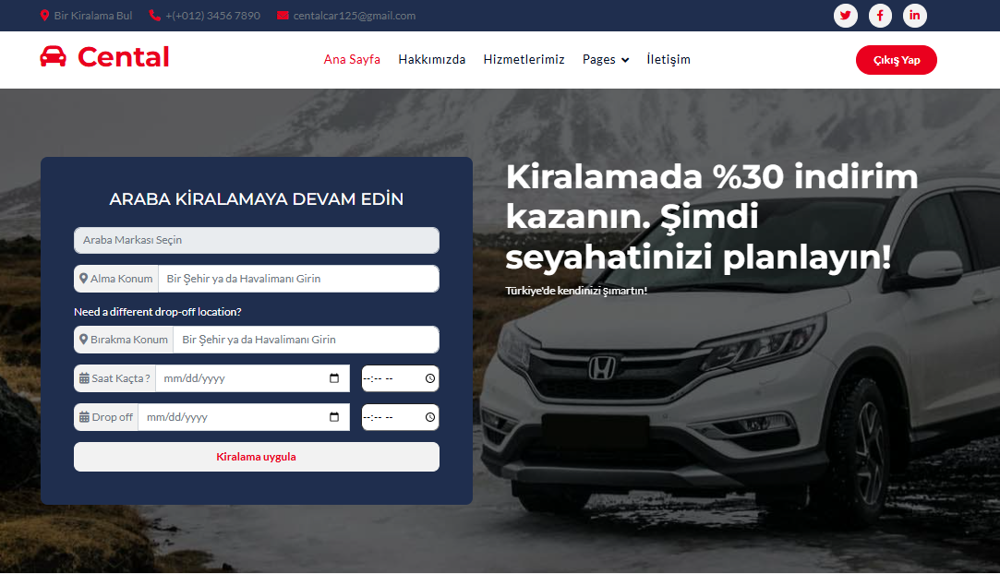
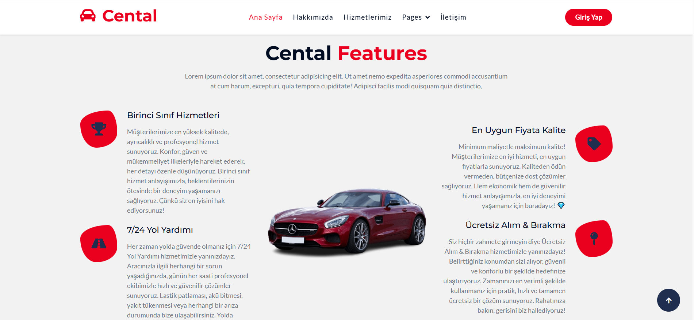
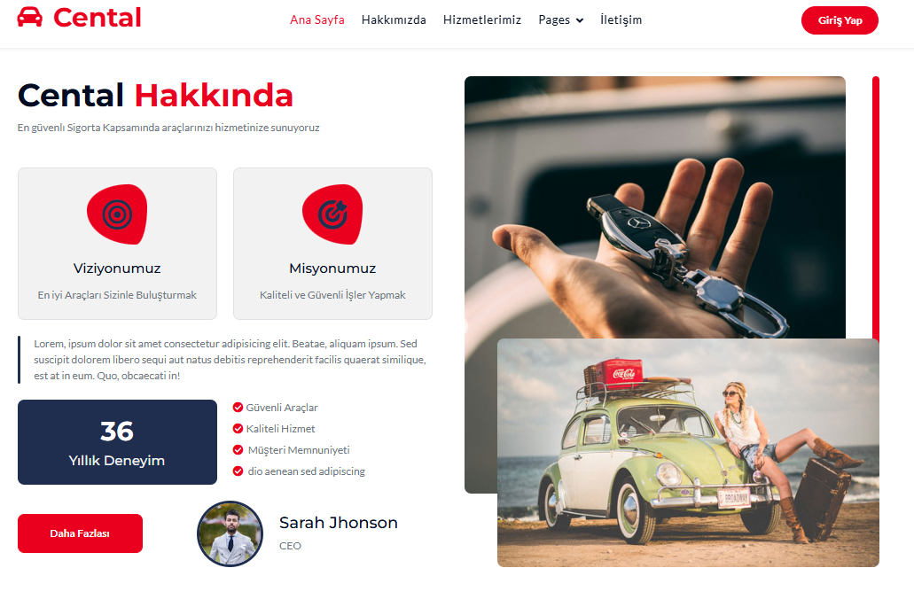
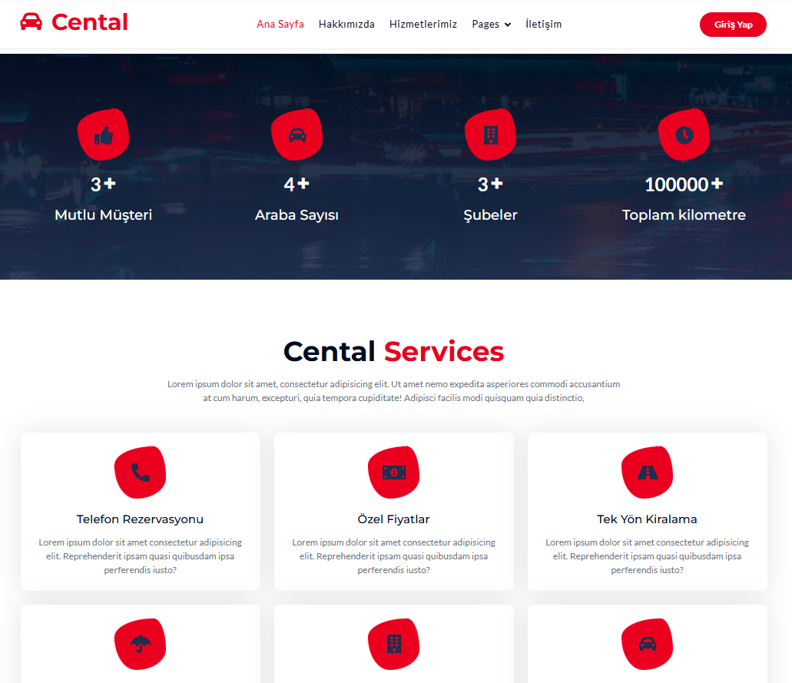
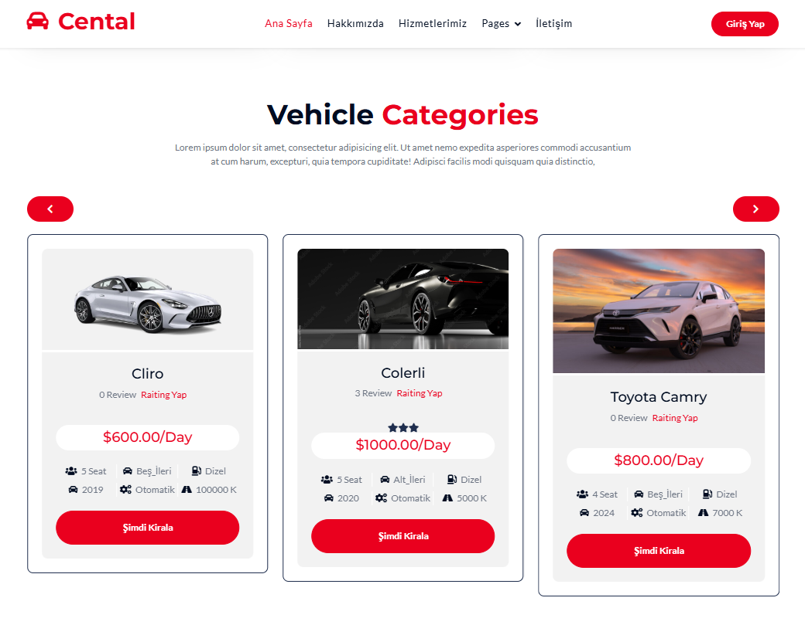
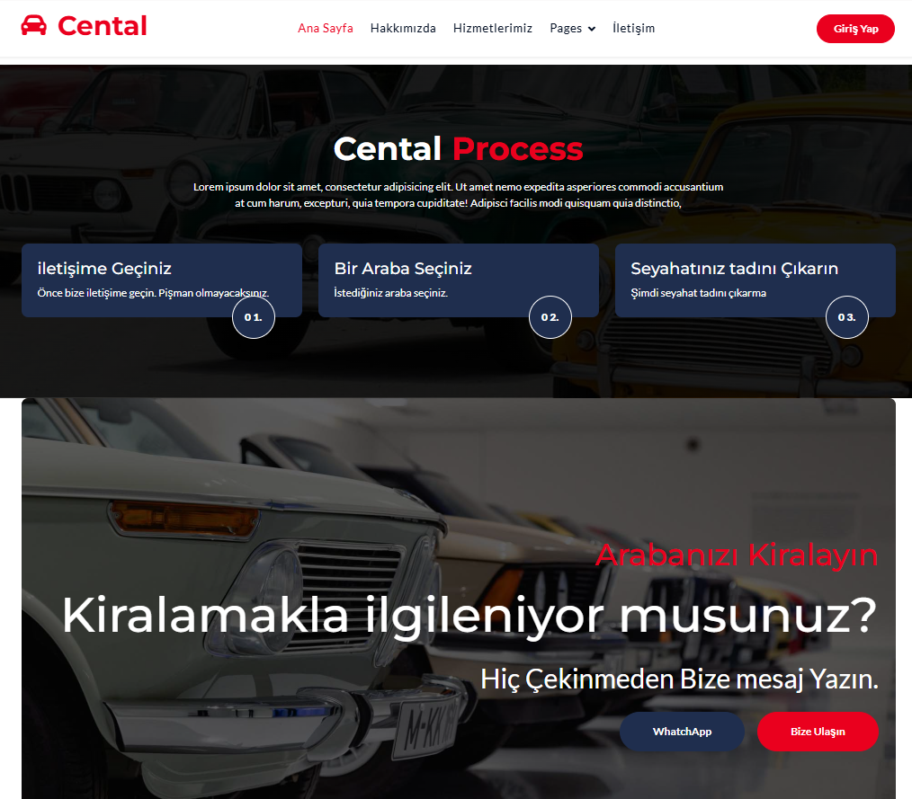
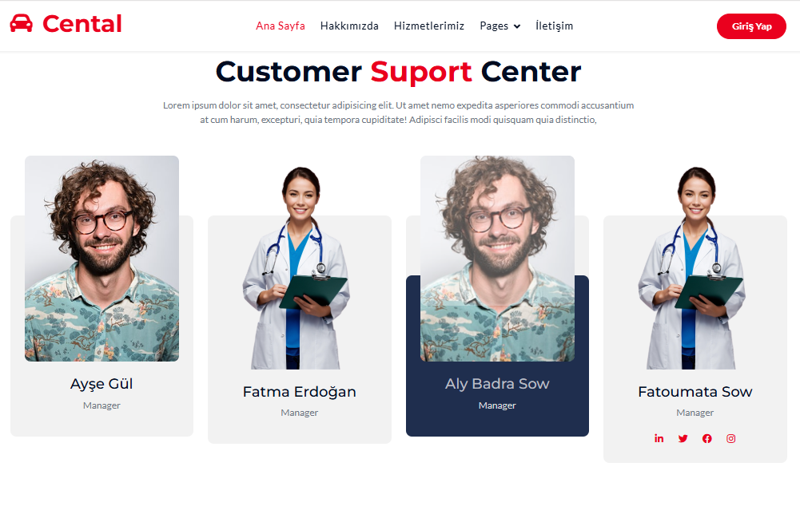
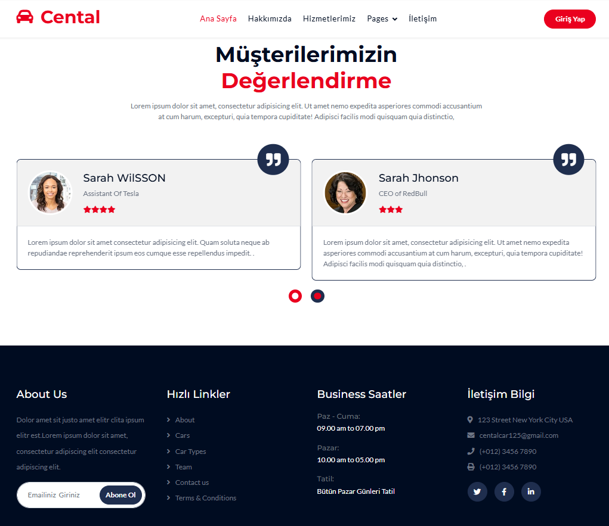
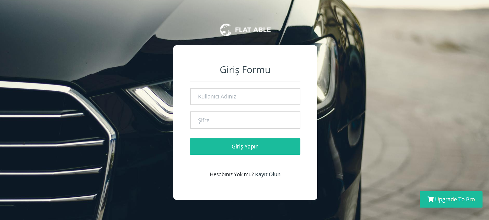
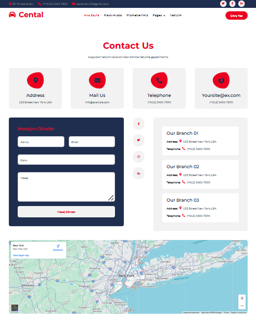
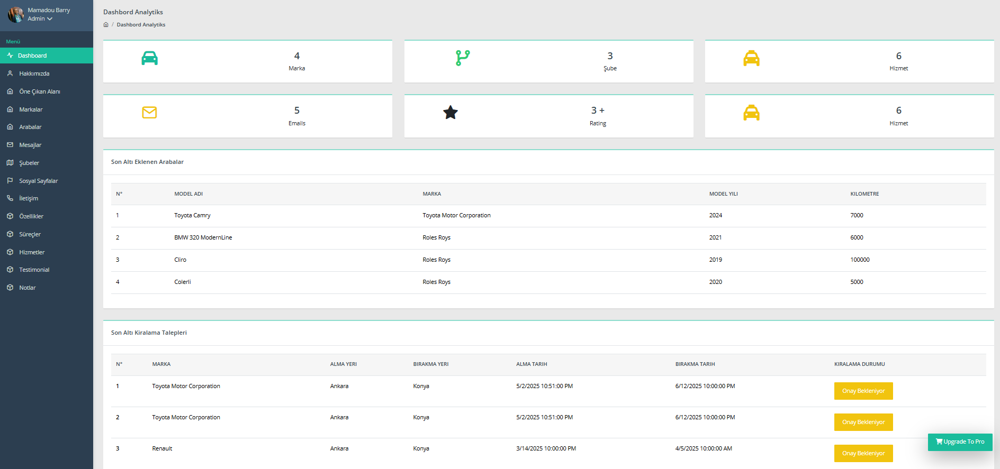
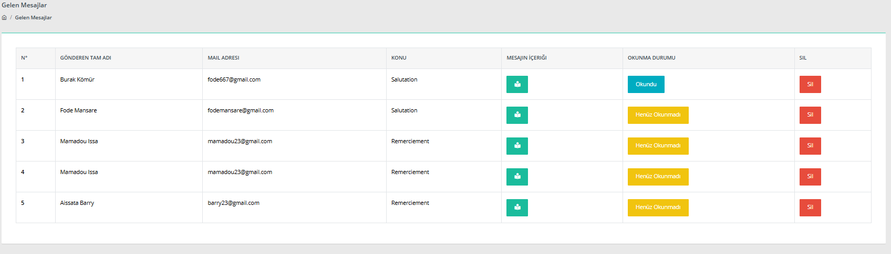
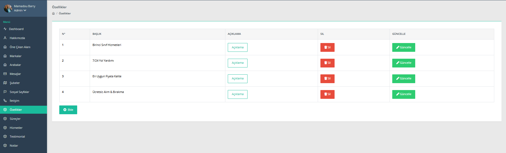
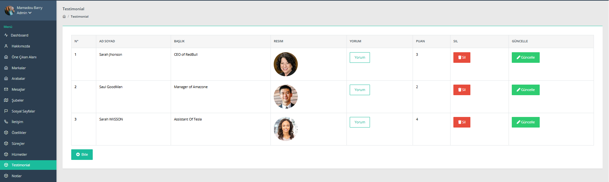
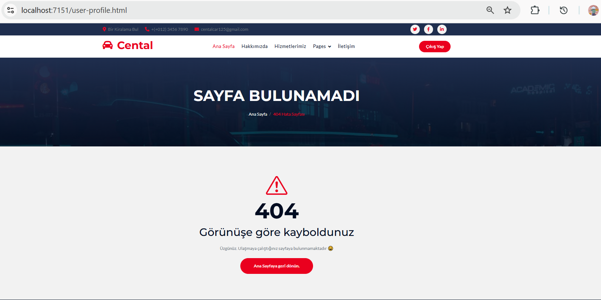
